# Banking System API

## 📌 Project Overview

Designed and developed a Banking REST API using Spring Boot with a layered architecture (Controller, Service, Repository).

Implemented core banking features like account creation, deposit, withdrawal, and deletion. Applied DTO pattern for clean data transfer and global exception handling for robust error management.

---

## 🚀 Features

- Create Bank Account
- Get Account Details
- Deposit Money
- Withdraw Money
- Delete Account
- Global Exception Handling

---

## 🛠 Tech Stack

- Java
- Spring Boot
- Spring Data JPA
- MySQL
- Maven

---

## 📂 Project Structure

- Controller → Handles API requests
- Service → Business logic
- Repository → Database interaction
- DTO → Data transfer objects
- Mapper → Entity ↔ DTO conversion
- Exception → Custom exception handling

---

## ⚙️ Configuration

Create your own `application.properties`:

```
spring.datasource.url=jdbc:mysql://localhost:3306/banking_db
spring.datasource.username=your_username
spring.datasource.password=your_password
```

---

## ▶️ Run the Project

1. Clone repository  
2. Configure database  
3. Run `BankingServiceApplication.java` 

--- 

## 📌 API Endpoints

| Method | Endpoint | Description |
|--------|--------|-------------|
| POST | /api/accounts | Create account |
| GET | /api/accounts/{id} | Get account |
| GET | /api/accounts | Get all accounts |
| PUT | /api/accounts/{id}/deposit | Deposit |
| PUT | /api/accounts/{id}/withdraw | Withdraw |
| DELETE | /api/accounts/{id} | Delete |

---

## 📄 License

This project is licensed under the MIT License.

---

## 📸 API Screenshots

### 🟢 Create Account

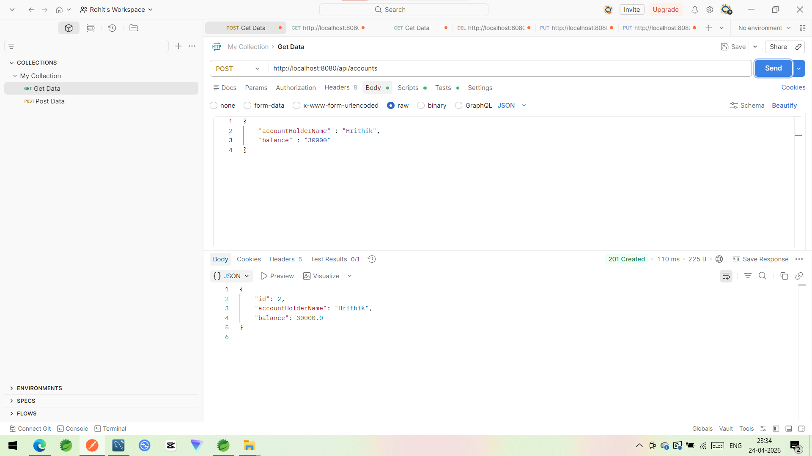
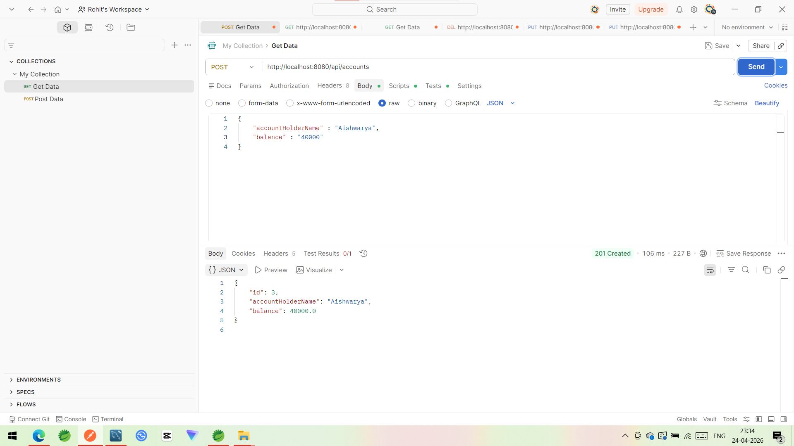


---

### 🟢 Get Account
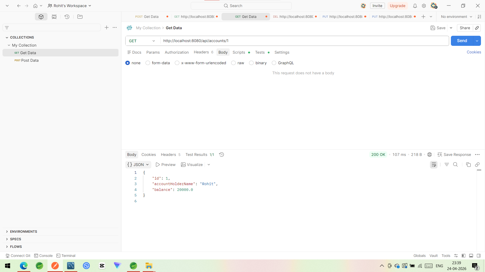


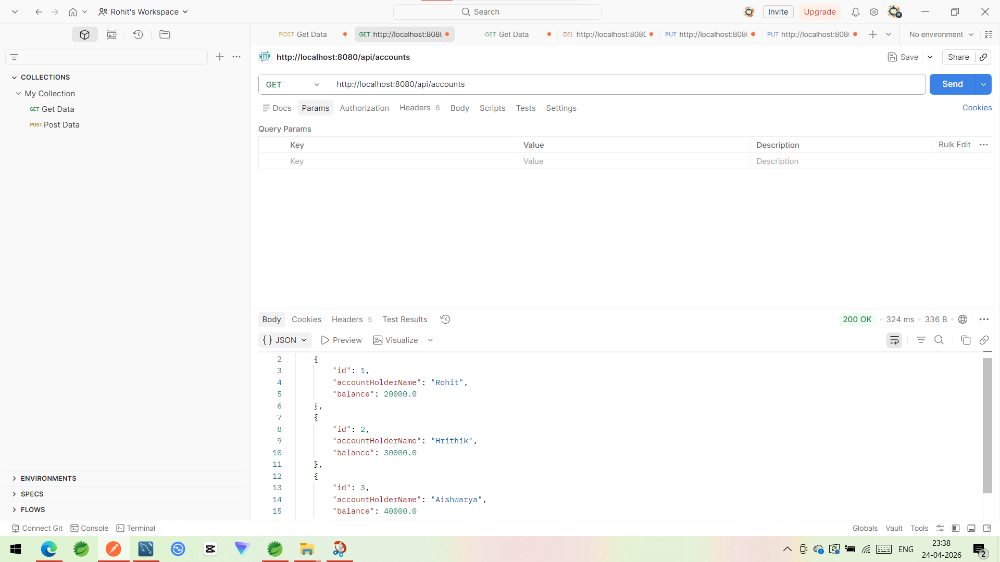

---

### 🟢 Deposit
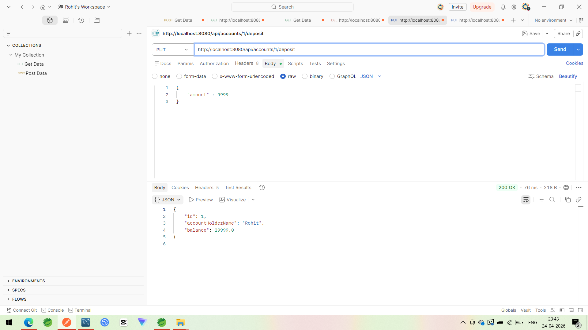
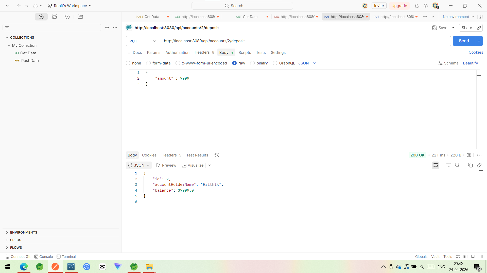

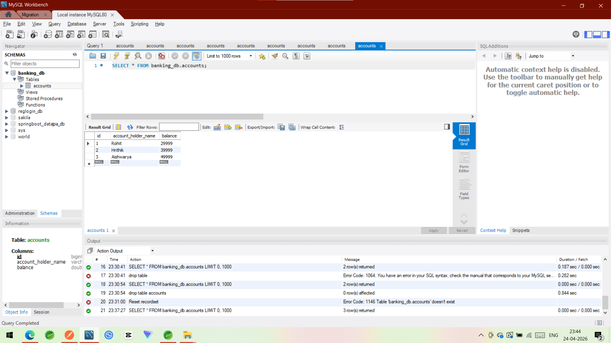

---

### 🟢 Withdraw
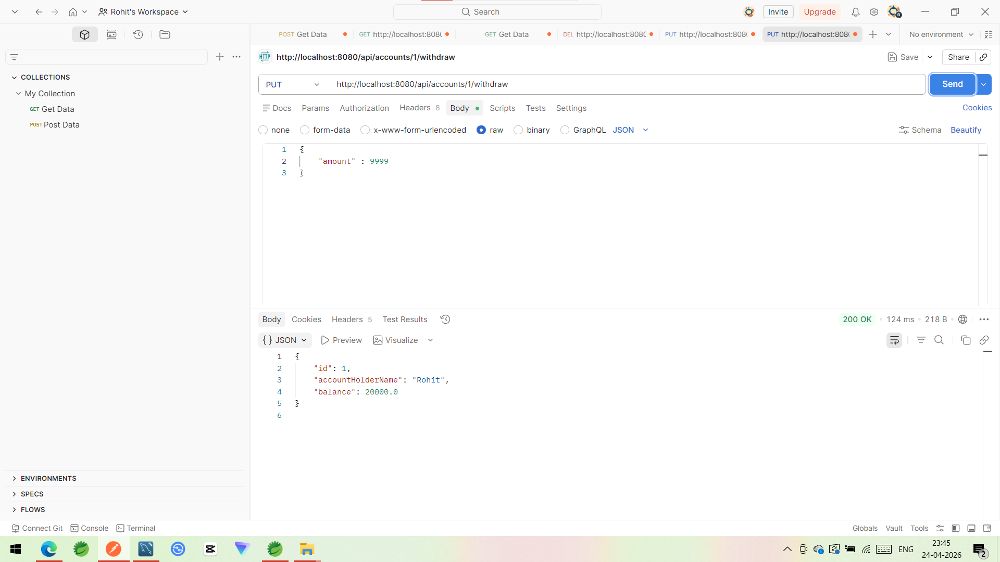
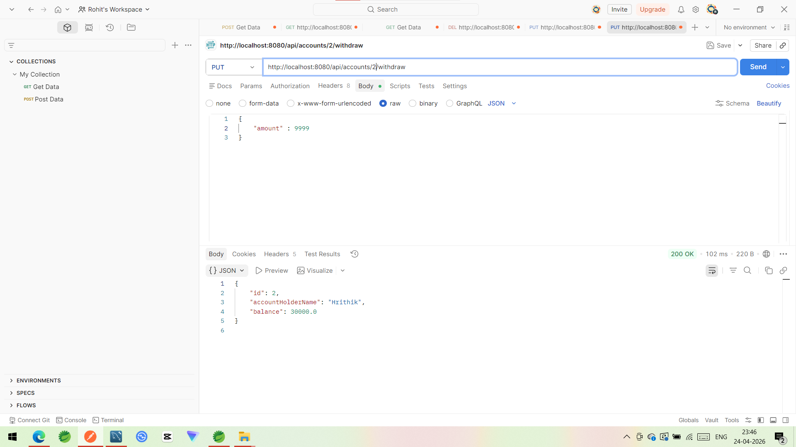

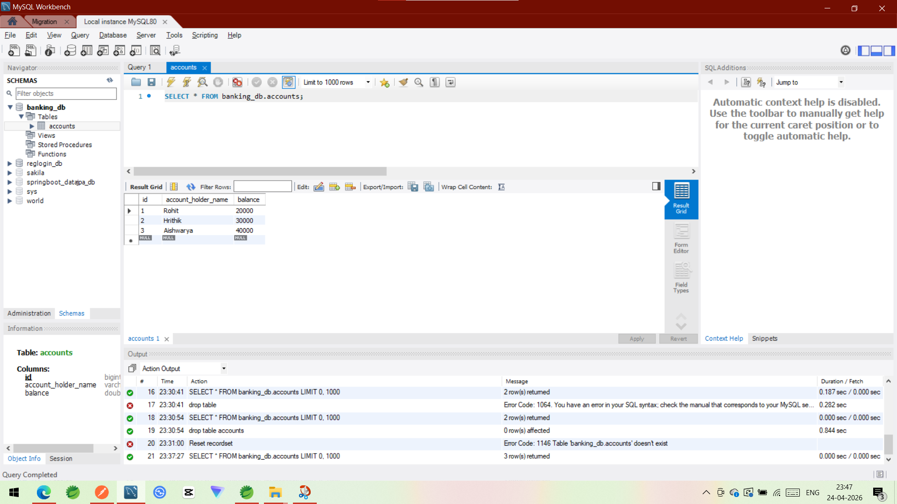

---

### 🟢 Delete Account

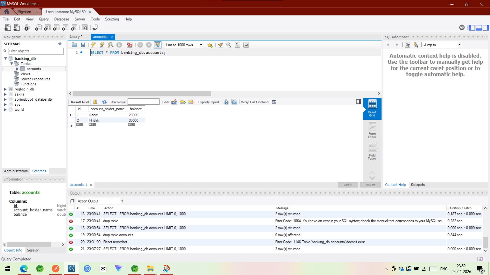

---

### 🔴 Exception Handling
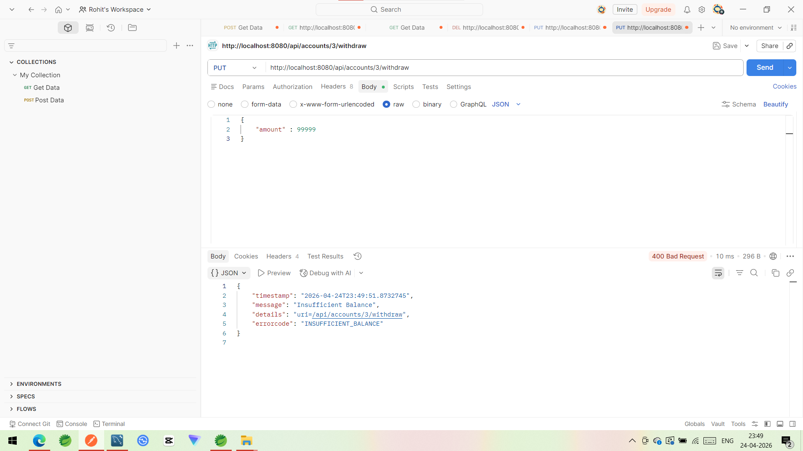
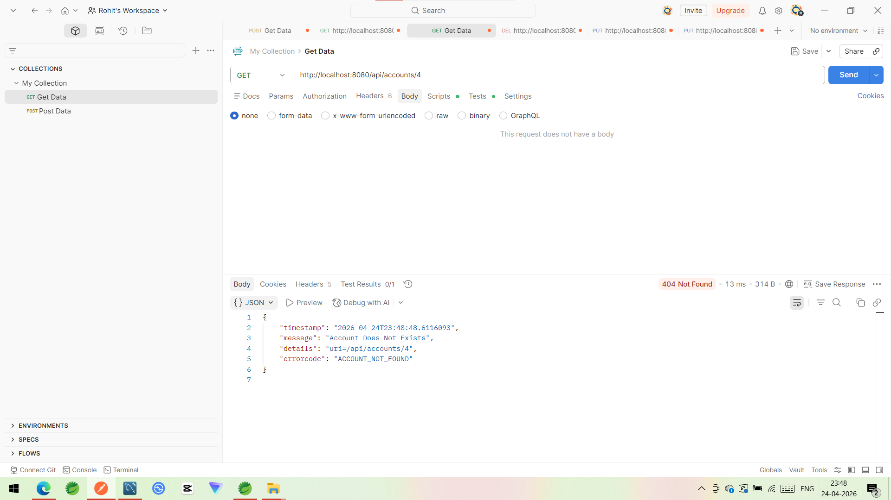

---
